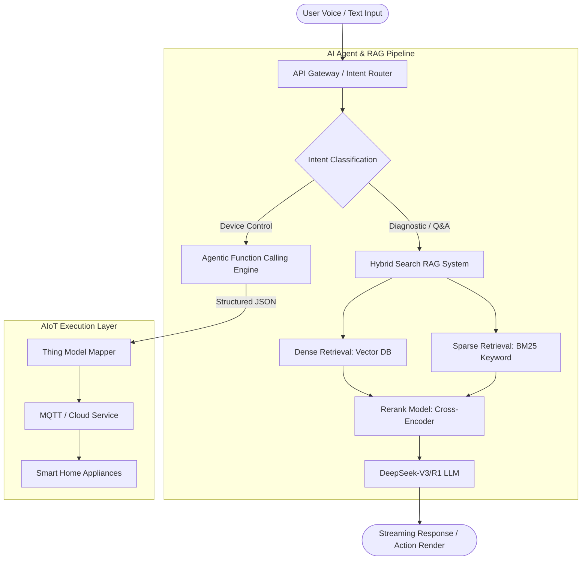

# 🤖 AIoT-LLM-RAG-SmartHome-Engine

An enterprise-grade **GenAI & Hybrid Search RAG Architecture** integrated with **Agentic Workflows** for next-generation smart appliance interaction and diagnostic systems.

---

## 🌟 Architecture Overview

This architecture bridges standard IoT protocols with Generative AI models (e.g., DeepSeek-V3/R1), solving traditional home automation pain points such as rigid intent recognition and complex diagnostic flows.

Key Technical Highlights
1. Hybrid Retrieval & Reranking: Combines dense vector retrieval (Milvus/Chroma) with BM25 keyword matching to handle 2000+ appliance manuals, boosting Q&A retrieval precision to 92%+.
2. Deterministic Control (Function Calling): Utilizes strict JSON Structured Outputs to map fuzzy user intents ("It's a bit cold in the living room") into exact Thing Model commands (⁠set_temperature: 24°C⁠).
3. Latency Optimization: Implemented streaming responses and local intent caching, reducing end-to-end control latency by 30%.

📁 Repository Structure

├── docs/
│   ├── system_architecture.pdf    # Detailed System Design Document
│   └── api_spec_openapi.yaml      # OpenAPI 3.0 Specs for Client & Cloud
├── prompts/
│   ├── system_prompt_control.json # System Prompts for Device Control
│   └── system_prompt_rag.json     # Prompts for RAG Context Integration
└── schemas/
    └── thing_model_example.json   # Standardized Thing Model Definition

📄 License & Confidentiality
Notice: This project is a generic, de-sensitized architectural reference for AIoT and RAG integration and contains no proprietary source code or confidential data from former employers.

